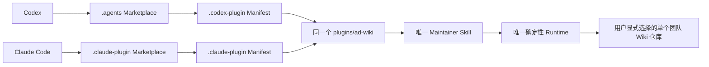
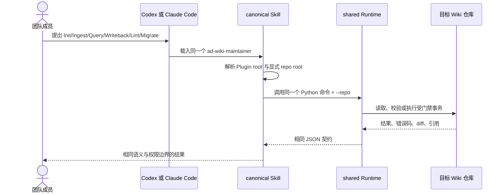

# Technical Design: AD-Wiki Codex / Claude Code 双宿主 Plugin

Design identity: `ad-wiki-dual-host-plugin-v0.3-accepted`

Product Contract: `docs/product-specs/ad-wiki-repository-local-scope.md`

Requirements covered: R1-R8, R10-R13

Authority: 用户于 2026-08-16 提出双端兼容要求，并通过显式调用 `ad-lfg` 接受本设计进入端到端实施

## 1. 决策摘要

AD-Wiki 采用“**双清单、单核心**”结构：

- Codex 与 Claude Code 各自拥有原生 Plugin Manifest 和 Marketplace Catalog；
- 两个 Marketplace 条目都指向同一个 `plugins/ad-wiki/`；
- 两个宿主共同加载唯一的 `skills/ad-wiki-maintainer/SKILL.md`，并共同使用同一套 references、templates 和 Python Runtime；
- 宿主元数据不承载 Wiki 维护逻辑，不复制第二套提示词；
- 本功能以 Plugin `0.3.0` 发布，不改变 OKF `0.2`、AD-Wiki Profile `0.1` 或任何团队 Wiki 数据；
- 不增加 MCP、App、Hook、Agent、服务端、身份系统或跨仓库能力。

这项设计只适配“能力如何被两个 Agent 宿主安装和调用”，不改变“每个团队知识库在自己的 Git 仓库中保存内容、配置和历史”的产品边界。

## 2. 当前行为、约束与证据

当前发行物只有 Codex 入口：

- `.agents/plugins/marketplace.json` 提供 Codex Marketplace；
- `plugins/ad-wiki/.codex-plugin/plugin.json` 提供 Codex Plugin 元数据；
- `plugins/ad-wiki/skills/ad-wiki-maintainer/` 与 `plugins/ad-wiki/scripts/` 已经位于 Plugin 根目录内；
- 当前 Plugin 是 `0.2.0`，没有 MCP、App 或 Hook；
- 确定性 Runtime 与知识仓库解耦，所有命令都显式接收 `--repo`。

Claude Code 的原生布局同样从 Plugin 根目录发现 `skills/`，但要求自己的 `.claude-plugin/plugin.json`；团队 Marketplace 位于发行仓库根部的 `.claude-plugin/marketplace.json`。Marketplace 安装后，Claude Code 会把整个 Plugin 目录复制到本地缓存，所以 Runtime 不得引用 Plugin 根目录之外的文件。

官方依据：

- [Claude Code Plugins Reference](https://code.claude.com/docs/en/plugins-reference)
- [Claude Code Plugin Marketplaces](https://code.claude.com/docs/en/plugin-marketplaces)
- [Claude Code Skills](https://code.claude.com/docs/en/slash-commands)
- [OpenAI：Plugins in Codex](https://help.openai.com/en/articles/20001256-plugins-in-codex/)
- Codex Manifest 与 Marketplace 的具体 Schema 以本机随 Codex 分发的 `plugin-creator` validator 为实现依据。

必须保留的产品不变量：

1. Plugin 只提供能力，不托管任何团队知识。
2. 一次操作只绑定一个显式知识仓库根目录。
3. `raw/` 不可变，`wiki/` 是 OKF Bundle，`.ad-wiki/` 是 Bundle 外的本地运行状态。
4. 双宿主执行同一操作时，使用相同的风险、审批、校验、回滚和引用规则。
5. Plugin 更新不能静默迁移 Wiki。

## 3. 结构与所有权

```text
ad-wiki-distribution/
├── .agents/
│   └── plugins/
│       └── marketplace.json           # Codex Catalog Adapter
├── .claude-plugin/
│   └── marketplace.json               # Claude Code Catalog Adapter
└── plugins/
    └── ad-wiki/                        # 唯一 Plugin 根目录
        ├── .codex-plugin/
        │   └── plugin.json             # Codex Manifest Adapter
        ├── .claude-plugin/
        │   └── plugin.json             # Claude Code Manifest Adapter
        ├── skills/
        │   └── ad-wiki-maintainer/
        │       ├── SKILL.md             # canonical 行为入口
        │       ├── agents/openai.yaml   # Codex 展示元数据；不改变核心行为
        │       └── references/          # canonical 协议与策略
        ├── scripts/                     # canonical 确定性 Runtime
        ├── examples/
        └── tests/
```

所有权边界：

| 层 | 负责内容 | 不得负责 |
| --- | --- | --- |
| Codex Adapter | Codex Manifest、展示字段、安装策略和 Marketplace source | Wiki 操作流程、领域规则、Runtime 分叉 |
| Claude Adapter | Claude Manifest、展示字段、原生 namespace 和 Marketplace source | 第二份 Skill、Claude 专属业务语义 |
| Shared Skill | 操作路由、读取顺序、不变量、权限停止点 | 宿主安装状态、团队知识内容 |
| Shared Runtime | 路径隔离、Raw Guard、事务、索引、校验、搜索 | LLM 语义判断和宿主配置写入 |
| Team Wiki | Raw、Concept、Index、Log、领域配置和 Git 历史 | Plugin 提示词、Plugin Runtime |



## 4. Manifest 契约

两个 Manifest 的公共发布身份为：

| 字段 | Codex | Claude Code | 规则 |
| --- | --- | --- | --- |
| `name` | `ad-wiki` | `ad-wiki` | 永久稳定，不通过改名发布新版本 |
| `version` | `0.3.0` | `0.3.0` | 正式发行必须完全一致 |
| `description` | 相同语义 | 相同语义 | 描述 repository-local Wiki 能力 |
| `author.name` | `AD Wiki Team` | `AD Wiki Team` | 保持一致 |
| `skills` | `./skills/` | `./skills/` | 都指向 shared skill 根目录 |

Codex Manifest 保留 `interface` 块，用于显示名、能力和 starter prompts。Claude Code Manifest 使用其原生顶层 `displayName`，不复制 Codex `interface`；这样 `claude plugin validate --strict` 不会因其他生态字段发出 warning。

两个 Manifest 都不得声明实际不存在或本版本明确排除的 `mcpServers`、`apps`、`hooks`、`agents`、`commands`、`lspServers` 或远程服务。

正式发布的版本是稳定 SemVer。Codex 本地开发若需要 cachebuster，只允许临时使用 `<base>+codex.<token>`；兼容检查比较其 base version 与 Claude version，并禁止把 cachebuster 带入正式发行提交。

## 5. Marketplace 契约与安装流程

两个 Catalog 都命名为 `ad-wiki-team`，都只发布一个名为 `ad-wiki` 的 Plugin，并解析到同一个仓库内路径。

| 宿主 | Catalog 文件 | Plugin source 表达 |
| --- | --- | --- |
| Codex | `.agents/plugins/marketplace.json` | `{ "source": "local", "path": "./plugins/ad-wiki" }` |
| Claude Code | `.claude-plugin/marketplace.json` | `"./plugins/ad-wiki"` |

Claude Marketplace 条目不重复声明版本；`.claude-plugin/plugin.json` 是 Claude 版本权威。Codex Marketplace 继续持有 `AVAILABLE` / `ON_INSTALL` 策略，保持当前团队主动安装方式。

Codex 安装：

```bash
codex plugin marketplace add <distribution-repo>
codex plugin add ad-wiki@ad-wiki-team
```

Claude Code 安装：

```bash
claude plugin marketplace add <distribution-repo>
claude plugin install ad-wiki@ad-wiki-team
```

Claude Code 中显式调用名为 `/ad-wiki:ad-wiki-maintainer`；自动触发仍由 canonical Skill 的 `description` 决定。Codex 继续通过相同 Skill 名与描述发现能力。

安装命令修改用户或项目的宿主配置，因此发行测试只在隔离的临时用户/容器中执行；Plugin 自身永不自动注册 Marketplace、修改宿主全局设置或替团队选择安装 scope。

## 6. Skill 与 Runtime 的宿主无关路径

当前 Skill 中的 `../../scripts/*.py` 必须改为显式的“从已安装 Skill 位置解析 Plugin 根目录”，避免把调用错误地解释为相对知识仓库当前目录：

1. Claude Code 使用其官方 `${CLAUDE_SKILL_DIR}`，Plugin 根目录为 `${CLAUDE_SKILL_DIR}/../..`。
2. Codex 使用运行时提供的已安装 `SKILL.md` 绝对路径，其 Plugin 根目录同样是 Skill 目录向上两级。
3. Agent 在首次执行命令前规范化该路径，并确认目标同时包含 `scripts/` 与当前宿主 Manifest；校验失败时停止，不扫描用户主目录猜测安装位置。
4. 后续命令统一表示为 `python3 <plugin-root>/scripts/<command>.py ...`，始终把知识仓库作为显式 `--repo` 参数传入。

`${CLAUDE_SKILL_DIR}` 只用于定位打包资源，不进入 Wiki 配置或运行记录。Shared Skill 可以包含这段薄宿主路径说明，但 Init、Ingest、Query、Writeback、Lint、Migrate 的行为正文保持唯一。

## 7. 数据流与工作流一致性



宿主只影响 Skill 如何被安装和命名，不影响 Runtime 输入输出。两个宿主都不得通过自己的扩展能力绕过 `prepare -> approve -> apply -> review` 状态机。

## 8. 兼容、升级与恢复

- 现有 Codex 用户从 `0.2.0` 更新到 `0.3.0`；原 Codex Marketplace 路径、Plugin 名和 Skill 名不变。
- Claude Code 用户首次添加同一发行仓库并安装 `ad-wiki@ad-wiki-team`。
- Wiki 的 OKF/Profile 版本不变，不执行内容迁移，不修改 `ad-wiki.yaml`。
- 一个宿主的 Manifest 或 Catalog 校验失败时，只阻止该发行候选，不回退为复制 Skill 或修改 Wiki。
- Plugin root 无法解析时，操作在读取或写入 Wiki 前失败，并报告所检查的 Skill 路径和缺失组件。
- Plugin 升级后，进行中的 `.ad-wiki/runs/` 继续由现有 run schema 管理；本功能不改变 run state。
- 回滚只需撤销四类兼容文件/说明及版本号；共享 Runtime 和 Wiki 数据不需要反向迁移。

## 9. 安全与权限

双宿主适配不扩张工具权限：

- 不声明 MCP、App、Hook 或后台执行；
- Marketplace 安装与 scope 由用户或团队管理员显式选择；
- 来源中的指令仍作为不可信数据；
- Runtime 仍拒绝仓库外路径和 Raw 变更；
- 任何 Git Commit、Push、PR、权限修改或宿主配置写入仍需独立授权；
- Claude Code 的 Plugin cache 中只包含 Plugin 根目录内文件，Shared Runtime 不访问发行仓库的相邻目录。

## 10. 验证契约

### 静态与打包验证

1. Codex 官方 `validate_plugin.py plugins/ad-wiki` 通过。
2. Claude Code `claude plugin validate plugins/ad-wiki --strict` 通过。
3. Claude Code `claude plugin validate . --strict` 验证 Marketplace 通过。
4. Agent Skill 官方 `quick_validate.py` 验证 canonical Skill 通过。
5. Packaging tests 验证：
   - 两个 Manifest 的稳定 `name`、正式 `version`、author 和 skills path；
   - 两个 Marketplace 都解析到 `plugins/ad-wiki/`；
   - 仓库内只有一个 `ad-wiki-maintainer/SKILL.md` 和一套 Runtime；
   - 没有声明 MCP/App/Hook/Agent 等延期能力；
   - 不存在正式发行 cachebuster。

### 宿主发现与安装

- 在隔离的临时用户或容器中分别执行 Codex 和 Claude Marketplace add、Plugin install、list/details；不得修改开发者现有的全局配置。
- Claude 验证 `/ad-wiki:ad-wiki-maintainer` 可发现；Codex 验证相同 Skill 元数据可发现。
- 若 CI 环境缺少任一官方 CLI，该宿主的发行证据为缺失，不能以 JSON parse 代替完整的双端兼容结论。

### 行为一致性

- 两个宿主各用全新上下文和临时知识仓库完成 Init、只读 Query、一次 medium-risk staged write；
- 比较生成的目录结构、命令 JSON schema、Raw hash、validation code、事务状态和失败行为，而不是比较 LLM 的逐字表述；
- 运行完整 Python tests、compile check 和双仓库隔离测试，证明适配层没有改变 shared Runtime。

人工体验验收由真实团队成员分别在 Codex 与 Claude Code 中完成一次安装和调用；工程自动化负责打包、协议和仓库副作用一致性。

## 11. 备选方案与取舍

### 方案 A：为两个宿主维护两份完整 Plugin

拒绝。它会复制 Skill、references 和 Runtime，使风险门禁、OKF 规则及修复产生漂移；也违反“团队知识库不复制整套提示词”的产品方向。

### 方案 B：让两个宿主共用同一个 Manifest

拒绝。Manifest 路径不同，Codex 的 `interface` 与 Claude Code 的顶层 `displayName` 也属于不同 Schema。虽然 Claude 会容忍未知字段，但 strict validation 会报告 warning，无法形成干净的发行契约。

### 方案 C：只发布 Agent Skill，不提供原生 Plugin Marketplace

拒绝。核心 Skill 可能可读，但不能满足团队通过两个宿主各自原生 Plugin 体系进行发现、安装、版本管理和更新的要求。

## 12. 风险

- 两个 Manifest 的元数据可能漂移。通过同一 release version 和 packaging contract test 阻断。
- Skill 内脚本路径在 Plugin cache 中可能解析错误。通过宿主明确的 Skill 根定位、Plugin 内闭包检查和安装后 smoke test 防止。
- 两个 LLM 宿主的自然语言执行可能存在差异。以确定性 Runtime、JSON 错误码和副作用契约作为一致性边界，不承诺逐字输出一致。
- 宿主 Plugin Schema 仍在演进。每次发布使用被记录的 CLI 版本运行官方 validator；Schema 变化只修改薄 Adapter，不能分叉核心工作流。

## 13. Scope delta 与 ADR 判断

相对当前 `0.2.0`，本次新增 Claude Code 原生 Manifest、Marketplace、路径解析与双宿主验证；不新增 Wiki 操作或远程能力。

“双清单、单核心”是本功能的局部打包设计，结构简单且可随宿主 Schema 变化调整，目前不单独创建 ADR。若未来第三个宿主加入、需要生成器或公共 Manifest schema，再评估提升为长期架构决策。

## 14. 开放技术决策

无。本文已固定会影响实现或用户可观察行为的选择，并已获得实施授权。
