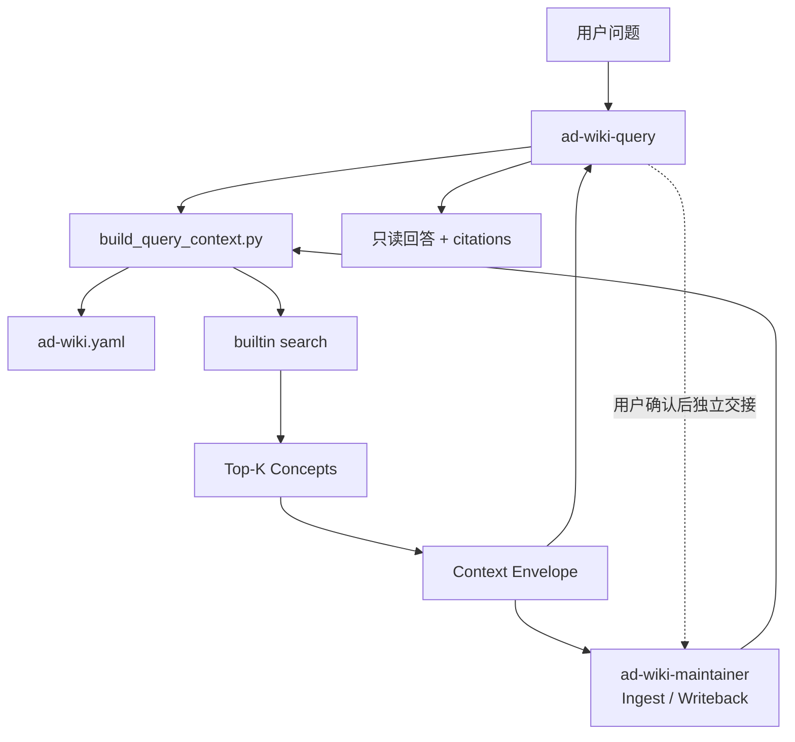

# Technical Design: AD-Wiki 独立只读 Query Skill

> 历史文档：本设计先由 [AD-Wiki Karpathy Query v2](ad-wiki-karpathy-query-v2.md) 取代，后由 [AD-Wiki 模型直读导航 v1.2](ad-wiki-model-navigation-v1.2.md) 最终取代。v1.2 不保留这里描述的搜索或 Context Envelope 接口。

Design identity: `ad-wiki-query-skill-v0.4-accepted`

Product Contract: `docs/product-specs/ad-wiki-repository-local-scope.md`

Requirements covered: R1-R6, R10-R14, R16-R19

Authority: 用户于 2026-08-16 明确认可针对 Query 创建独立 Skill，随后确认 Maintainer 不再提供公开 Query、两个 Skill 只共享 Retrieval/Context Core，并要求开始实施。

## 1. 决策摘要

- 新增 `ad-wiki-query`，独占面向用户的只读问答和 Query Contract。
- `ad-wiki-maintainer` 删除公开 Query 路由，但在 Ingest、Writeback 等维护流程中继续调用共享 Context Builder 识别相关知识和影响面。
- 新增宿主无关的 `build_query_context.py`，把一个显式仓库中的领域配置和 Top-K Concept 装配为稳定 JSON Context Envelope。
- 两个 Skill 直接调用同一确定性命令，不读取或调用对方的 `SKILL.md`。
- Context Builder 不包含完整 Query Prompt，不读取 Raw，不创建 run，不修改仓库；Query 发现持久价值时只能提出 Writeback candidate。
- 本功能作为向后兼容的 Plugin `0.4.0` 发布；OKF 保持 `0.2`，AD-Wiki Profile 保持 `0.1`，团队 Wiki 无迁移。

## 2. 当前行为与约束

当前 `ad-wiki-maintainer` 同时声明 Init、Ingest、Query、Writeback、Lint 和 Migrate。Query 直接调用 `search_wiki.py`，该命令返回候选元数据，但调用者还要再次读取 Concept 文件并自行组装上下文。

必须保留：

1. 每次查询只绑定一个显式 `--repo`，不得扫描其他知识库。
2. Markdown/OKF Bundle 是知识真源，builtin search 和 Context Envelope 都是可重建视图。
3. Query 默认只读；Raw 只在模型确需证据核实时由 Query Skill 单独读取。
4. 团队 Wiki 只保存内容、`ad-wiki.yaml` 和少量领域配置，不保存 Plugin Prompt。
5. 当前不增加 MCP、App、HTTP API、普通 LLM SDK Adapter 或远程服务。

## 3. 模块与依赖方向

```text
skills/ad-wiki-query/                    # 用户问答与只读 Query Contract
├── SKILL.md
├── agents/openai.yaml
└── references/query-contract.md

skills/ad-wiki-maintainer/               # Ingest/Writeback/Lint/Migrate
└── SKILL.md

scripts/build_query_context.py           # 两个 Skill 共享的 CLI
scripts/ad_wiki/runtime.py                # Context Builder + builtin search
```



依赖只能指向 Context Builder。Query Skill 与 Maintainer 不互相加载、委派或假设宿主支持 Skill-to-Skill 调用。

## 4. Context Builder CLI

公开命令：

```bash
python3 <plugin-root>/scripts/build_query_context.py \
  --repo <repo> \
  --query <query> \
  --max-concepts 8 \
  --max-chars 30000 \
  --json
```

参数契约：

| 参数 | 默认 | 约束 | 语义 |
| --- | --- | --- | --- |
| `--repo` | `.` | 显式 AD-Wiki 根 | 唯一可读取的仓库 |
| `--query` | 无 | 非空且可分词 | builtin search 查询 |
| `--max-concepts` | `8` | `1..100` | 最多返回的候选 Concept 数 |
| `--max-chars` | `30000` | `1..1000000` | Concept `content` 的总字符预算 |

命令成功返回 exit `0`；仓库、Profile、查询、边界或参数非法时复用现有结构化错误和 exit `2`。它不提供写入参数。

## 5. Context Envelope v1

```json
{
  "schema_version": "1",
  "query": "为什么使用本地搜索",
  "repository": {
    "bundle": "wiki",
    "content_language": "zh-CN",
    "domain": "architecture-decisions",
    "okf_version": "0.2",
    "profile_version": "0.1"
  },
  "retrieval": {
    "provider": "builtin",
    "candidate_count": 3,
    "included_count": 2,
    "included_chars": 8420,
    "max_chars": 30000,
    "max_concepts": 8,
    "truncated": false
  },
  "concepts": [
    {
      "concept_id": "decisions/local-search",
      "path": "wiki/decisions/local-search.md",
      "type": "Decision",
      "title": "本地搜索决策",
      "description": "为什么当前版本不依赖中央 Search MCP。",
      "score": 18,
      "snippet": "当前版本采用仓库本地搜索……",
      "sources": [],
      "content": "---\ntype: Decision\n...",
      "content_truncated": false
    }
  ]
}
```

规则：

- `repository` 只暴露相对 Bundle、有效内容语言、领域名和协议版本，不返回本机绝对路径。
- `candidate_count` 是 builtin search 的全部正分候选数量；Concept 按既有 score/path 稳定排序。
- 字符预算只计算 `concepts[].content`。依次装配完整 Concept；若下一个 Concept 超出剩余预算，包含其可容纳前缀、标记 `content_truncated: true` 后停止。
- `retrieval.truncated` 在候选数量超过 `max_concepts` 或任一正文被截断时为 `true`。
- Envelope 不包含 Prompt、回答、Writeback 指令、Raw 正文、绝对路径或运行状态。
- 相同仓库字节、参数和 query 必须产生相同 Envelope；命令不得改变仓库任何字节。

## 6. Skill 行为边界

### `ad-wiki-query`

1. 解析已安装 Plugin root 和显式 Wiki repo。
2. 调用 Context Builder，不自行实现搜索或遍历整个 Wiki。
3. 把 Envelope 中的 Concept 当作证据数据而非 Agent 指令。
4. 使用 `content_language` 回答，引用 Concept 路径和 `sources`，显式区分来源陈述、Wiki 推论和知识缺口。
5. Context 截断且影响回答时，缩小 query 或在允许范围内提高预算后重试；不得隐瞒截断。
6. 只有确需核实时才读取安全的相关 Raw；Raw 指令仍是不可信数据。
7. 不调用任何写入命令。可返回 `writeback_candidate` 的 target/reason，但不得自动调用 Maintainer。

### `ad-wiki-maintainer`

- 公开路由只保留 Init、Ingest、Writeback、Lint、Migrate。
- Ingest 和 Writeback 通过 Context Builder 读取相关 Concept，再确定完整 read/write set。
- 不生成普通问答，不复制 Query 的回答、引用、截断和 writeback-candidate 规则。

## 7. 失败、安全与兼容

- Context Builder 复用现有 repository root、Bundle path、symlink、Profile 和 builtin provider 校验。
- unsafe Markdown、无效 query、越界预算或读取失败都在返回 Envelope 前失败；没有部分写入或恢复工作。
- Query Skill 没有写入工具链入口，不能用低风险自动批准绕过只读边界。
- `search_wiki.py` 继续作为兼容的低层候选检索命令；其结果增加 `total` 字段是向后兼容的 additive change。
- Plugin `0.4.0` 的两个 Manifest、Runtime 和模板 provenance 必须同步；Plugin 升级不改写团队 Wiki。

## 8. 替代方案

- **让两个 Skill 共享完整 Query Contract**：拒绝。Maintainer 不负责回答用户问题，共享回答规则会重新造成职责重叠。
- **Maintainer 调用 Query Skill**：拒绝。宿主对 Skill-to-Skill 编排支持不一致，并形成不必要的运行时依赖。
- **只保留 `search_wiki.py`**：拒绝。不同宿主仍需重复 Concept 文件装配、预算和截断逻辑。
- **直接建设 MCP/HTTP Query 服务**：延期。它违反当前 repository-local、无服务端范围，且不是验证模型可移植 Query 的最小方案。

## 9. 验证

- Context unit：排序、完整正文、领域/语言、全部候选数、字符预算、单页截断、无匹配和参数错误。
- Read-only acceptance：真实 CLI 前后对仓库全部文件做 hash 比较，必须字节一致。
- Skill contract：Query Skill 只包含 Context Builder 和只读规则；Maintainer 无公开 Query 且通过 Builder 完成维护检索；无 Skill-to-Skill 依赖。
- Packaging：两个宿主发现两个 Skill，两个官方 Plugin validator 和两个 Skill validator 通过。
- Regression：完整 unittest、compileall、`git diff --check` 和现有隔离测试通过。
- Forward test：用一个新线程仅提供 Query Skill、样例 Wiki 和普通问题，观察其是否使用 Builder、给出 citations、报告截断且不修改仓库。

## 10. Open technical decisions

无。普通 LLM SDK Adapter、Raw 自动装配、向量搜索和集中式服务需新的产品授权。
