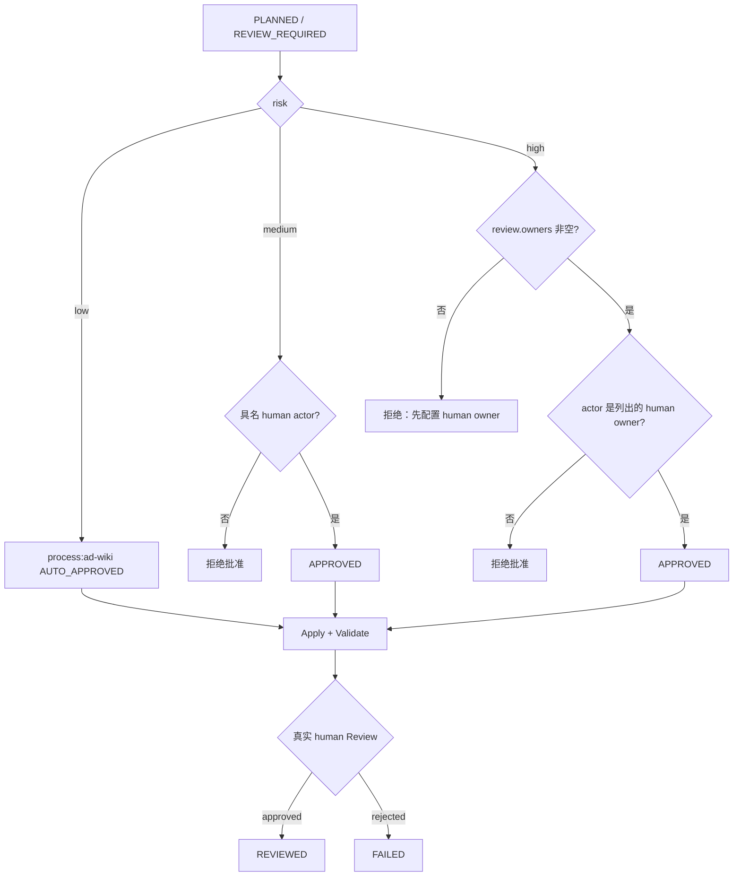
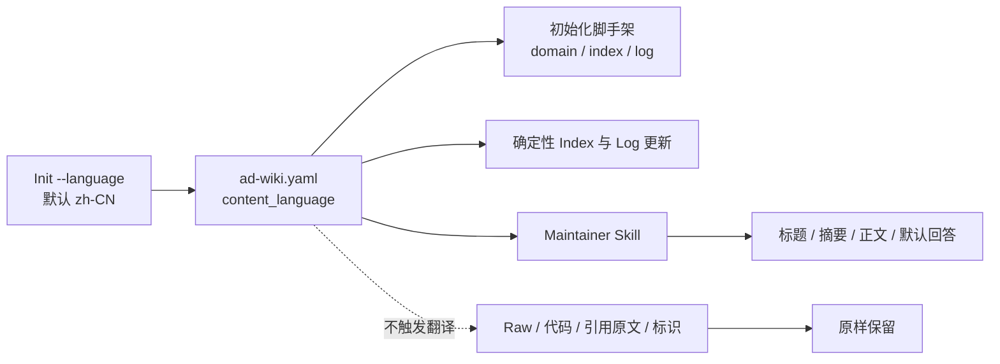

# Technical Design: AD-Wiki Owner 门禁与内容语言

> 历史文档：Owner/前置审批部分已被 v1.2 直接 Apply 合同取代；内容语言设计继续有效。当前行为见 [AD-Wiki 模型直读导航 v1.2](ad-wiki-model-navigation-v1.2.md) 和 Product Contract R15-R16。

Design identity: `ad-wiki-review-language-policy-v0.3-accepted`

Product Contract: `docs/product-specs/ad-wiki-repository-local-scope.md`

Requirements covered: R15-R16

Authority: 用户于 2026-08-16 接受推荐语义，确认 `review.owners` 仅约束高风险事前审批，并指定 Init 内容语言默认值为 `zh-CN`；随后显式调用 `ad-lfg` 授权本地实施。

## 1. 决策摘要

- `review.owners` 是高风险事务的 `human:<id>` 事前审批白名单，不是团队成员目录、日常 Reviewer 列表或身份认证系统。
- owner 为空时，低风险和中风险流程保持可用，高风险批准失败并提示如何配置 owner。
- 中风险仍需要明确的具名 human 写入授权，并在 Apply 后由任意真实 `human:<id>` 完成 Review；owner 白名单不参与这两个判断。
- Init 新增 `content_language`，当前只接受 `zh-CN` 和 `en`，默认 `zh-CN`。它控制 Agent 生成的 Wiki 文字和确定性脚手架，不翻译 Raw、代码、引用原文、专有标识或已有路径。
- 旧仓库缺少 `content_language` 时按 `zh-CN` 运行，但不自动改写配置或既有内容；AD-Wiki Profile 仍为 `0.1`，无需迁移。

## 2. 配置契约

新仓库写入 JSON-compatible YAML：

```yaml
content_language: zh-CN
review:
  medium_risk: post_apply
  high_risk: pre_apply
  owners:
    - human:team-knowledge-owner
```

字段规则：

| 字段 | 允许值 | 缺省行为 | 失败方式 |
| --- | --- | --- | --- |
| `content_language` | `zh-CN`, `en` | 旧仓库解释为 `zh-CN` | 其他值在 Init 或 Validate 时失败 |
| `review.owners` | 去重后的 `human:<id>` 列表 | 空列表，仅禁用高风险批准 | 非 human actor 或非列表在 Init/Validate 时失败 |

`init_bundle.py` 增加 `--language {zh-CN,en}` 和可重复的 `--owner human:<id>`。未传语言时写入 `zh-CN`；未传 owner 时 Init 成功，并在结果中返回“高风险事务尚未启用”的可操作 warning。API 采用同样的默认值和校验。

## 3. 审批与评审状态机



具体规则：

1. Low 可继续由 `process:ad-wiki` 自动批准；若调用者显式传 actor，仍按现有通用 actor 格式记录。
2. Medium 的批准 actor 必须为真实 `human:<id>`，但无需属于 owner 列表。
3. High 先要求至少一个 owner，再要求批准 actor 为列表中的 `human:<id>`。
4. Review 是事实审计记录，actor 必须为 `human:<id>`；任何风险级别都不能用 `process:` 或 Agent actor 伪造人工 Review。
5. owner/actor 字符串只声明本地运行记录中的责任主体。真实身份、仓库写权限和强制 Review 由 Git 托管平台、分支保护、PR 和 CODEOWNERS 等现有系统完成。

审批仍绑定完整 staged bytes 和规划时的 `ad-wiki.yaml` baseline。配置在 Prepare 后变化会继续触发 baseline drift，防止操作在未重新规划的策略下执行。

## 4. 内容语言数据流



Runtime 使用一个有效语言解析 helper：字段缺失返回 `zh-CN`，字段存在但不受支持则校验失败。Init、Index builder 和事务 Log writer 使用同一解析结果，避免一个仓库内的确定性标题漂移。

本次只本地化 Runtime 自己生成的固定文字：

- `.ad-wiki/domain.md` 的说明；
- 根和子目录 `index.md` 的标题、章节名与空状态；
- `wiki/log.md` 的标题和事务条目。

Concept 正文由 Maintainer Skill、Query 回答由 Query Skill 按配置生成。稳定的目录名、frontmatter key、operation、risk、run id、source id、错误码和 CLI JSON key 保持英文，避免破坏协议与自动化。

## 5. 兼容、恢复与失败处理

- 旧仓库不因缺少字段而失败，Index/Log 后续更新按 `zh-CN` 生成；现有文件仅在正常 Index/事务操作本来就会更新时改变，不执行批量翻译。
- 已显式配置 `en` 的仓库继续生成英文脚手架、Index 和 Log。
- 既有 owner 中出现 `process:` 或 Agent actor 会被 Validate 拒绝；它们从未能代表真实 human owner，使用者需改为 `human:<id>`。
- Init 遇到无效语言或 owner 时在创建任何目录前失败；遇到现有非一致文件时保持原有拒绝覆盖行为。
- 功能回退只需撤销可选字段、CLI 参数和本地化模板；没有 Profile migration，也不触碰 Raw 或已有知识正文。

## 6. 验证契约

- Init：默认 `zh-CN`、显式 `en`、可选 owner、空 owner warning、无效语言/owner 预检、幂等与不覆盖。
- Compatibility：删除旧 fixture 的 `content_language` 后仍通过 Validate，且运行时按 `zh-CN` 构建 Index/Log但不回写配置。
- Approval：空 owner 的 medium 成功、high 失败；配置 owner 后非 owner high 失败、owner high 成功；medium approval/review 不受 owner 限制。
- Human audit：medium/high approval 和所有 Review 拒绝非 `human:` actor。
- Language：`zh-CN` 与 `en` 的初始化文件、重建 Index 和事务 Log 分别使用对应固定文字；Raw 与 Concept 输入字节不被语言设置改写。
- Regression：完整 unittest、compileall、Plugin/Skill validators 与打包测试保持通过。

## 7. 非目标

本设计不增加身份系统、远程审批台、中央服务、自动翻译、已有 Wiki 批量改写、任意 locale、每页语言覆盖或跨仓库策略。未来若需要真实签名审批或多语言同页内容，应另立 Product Contract 与 Profile migration。
