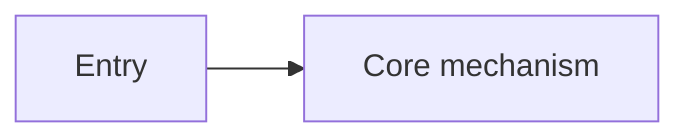

# <Base Concept>: Source Implementation

[Base knowledge](/<base-concept-id>.md)

## Code snapshot

- Revision: `<full-commit-sha>`
- Scope read: <paths/symbols actually read>
- Material scope not read: <unread scope>

## Public contract

<Summarize the documentation contract without overriding it.>[^code-source-id]

## Implementation principles

<Explain current implementation and invariants.>[^code-source-id]

## Runtime flow



## Core source

`<path>` — `<symbol>` — revision `<full-commit-sha>`

```text
<exact bounded source excerpt>
```

<Explain why this excerpt determines the behavior.>[^code-source-id]

## Key symbols and callers

- `<path>#<symbol>` — <responsibility>

## Related tests

The workflow read but did not execute these tests:

- `<test-path>#<test-symbol>` — <boundary declared by the test source>

## Documentation and code relationship

<consistent | implementation detail | apparent divergence | confirmed divergence>

## Uncertainty and continued reading

<State uncertainty and next source locations.>

[^code-source-id]: `<repo>` revision `<full-commit-sha>`, `<path>#<symbol>`.
