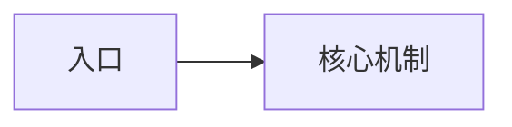

# <基础知识点>：源码实现

[基础知识](/<base-concept-id>.md)

## 代码快照

- Revision：`<full-commit-sha>`
- 已读范围：<实际读取的路径和符号>
- 未读重要范围：<未读取范围>

## 对外契约

<概括文档契约，不用代码覆盖文档。>[^code-source-id]

## 实现原理

<解释当前实现和关键不变量。>[^code-source-id]

## 运行流程



## 核心代码

`<path>` — `<symbol>` — revision `<full-commit-sha>`

```text
<真实且有界的源码片段>
```

<解释这些代码为什么决定了该行为。>[^code-source-id]

## 关键符号与调用方

- `<path>#<symbol>` — <职责>

## 相关测试

本流程只阅读、未执行以下测试：

- `<test-path>#<test-symbol>` — <测试源码声明的边界>

## 文档与代码关系

<一致 | 实现补充 | 待确认差异 | 已确认差异>

## 不确定性与继续阅读

<说明不确定性和后续源码入口。>

[^code-source-id]: `<repo>` revision `<full-commit-sha>`，`<path>#<symbol>`。
